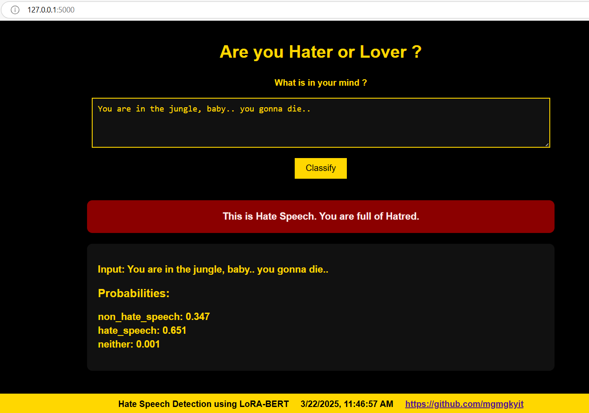
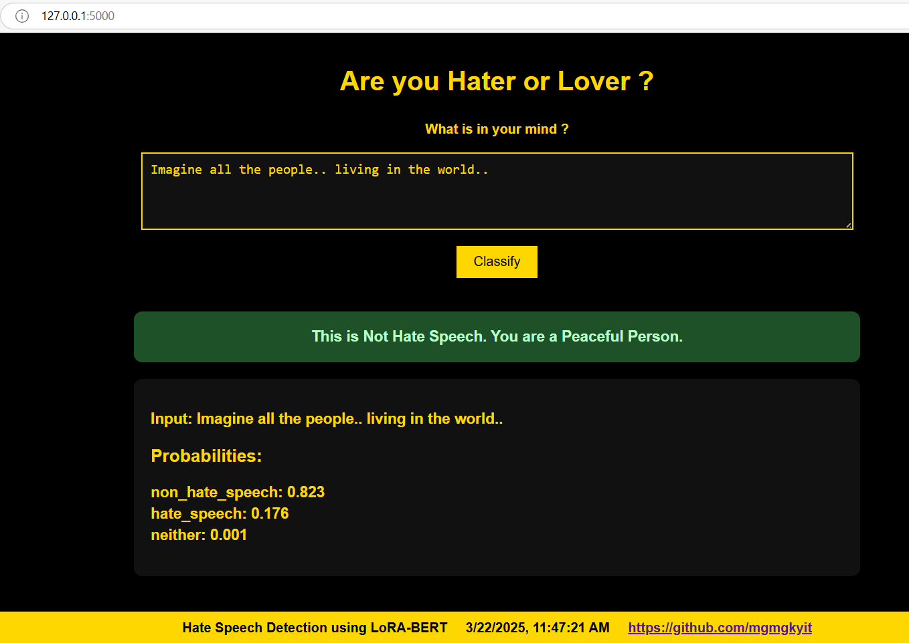

# DistillBERT vs LORA - with Low Rank Adaptation

By : Maung Maung Tyi Tha (st125214)

Exploring the comparison between Odd Layer and Even Layer Student Training Models and LoRA (Low-Rank Adaptation) on a distillation task using BERT.

---

## Table of Contents
- [1. Dataset](#dataset)
- [2. Odd/Even Layer Training](#oddevenlayertraining)
- [3. LoRA (Low-Rank Adaptation)](#lora)
- [4. Evaluation and Analysis](#evaluation)
- [5. Web Application](#webapplication)

## 1. Dataset

"thefrankhsu/hate_speech_twitter" hate speech classification dataset was used for training, which contains samples form twitter tweets.

The dataset comprises three key features: tweets, labels (with hate speech denoted as 1 and non-hate speech as 0), and categories.

    Source : https://huggingface.co/datasets/thefrankhsu/hate_speech_twitter

## 2. Odd/Even Layer Training

### Description

This task involves training a 6-layer student model using specific layers from a 12-layer teacher model (DistilBERT). The goal is to compare the performance of the student model when trained using odd layers versus even layers from the teacher.

#### Subtasks

##### Odd Layer Training

Train the student model using odd layers {1, 3, 5, 7, 9, 11} from the 12-layer teacher.

The student model will have 6 layers, each corresponding to one of the odd layers from the teacher.

##### Even Layer Training

Train the student model using even layers {2, 4, 6, 8, 10, 12} from the 12-layer teacher.

The student model will have 6 layers, each corresponding to one of the even layers from the teacher.

## 3. LoRA (Low-Rank Adaptation)

### Description

This task involves implementing LoRA (Low-Rank Adaptation), a parameter-efficient fine-tuning technique, for the student model. LoRA reduces the number of trainable parameters by injecting low-rank matrices into the model's weight matrices during fine-tuning.

### Key Steps

#### Implement LoRA

Modify the student model to include low-rank matrices in its weight layers.

Ensure that only the low-rank matrices are updated during fine-tuning, while the original weights remain frozen.

#### Fine-Tune the Student Model

Fine-tune the student model using LoRA on a downstream task.

Compare the performance of the LoRA-based student model with the standard fine-tuned student model.

#### Evaluate Efficiency

Analyze the reduction in trainable parameters and computational cost achieved by LoRA.

Compare the performance of the LoRA-based model with the baseline model.

## 4. Evaluation and Analysis

### Model Results

| Model Type   | Training Loss | Test Accuracy  |
|:------------:|:--------------:|:-----------------:|
| Odd Layer   | 0.3415 | 0.978  |
| Even Layer  | 0.3401  | 0.978  |
| LoRA        | 0.2199  | 0.747 |

It was observed that both Even and Odd layer student models have similar performances, with Even Layer slightly better Training Loss.
The LoRA model have better training loss than the Odd/Even Models, but LoRA have lower Test Accuracy. This may be due to the limited size of training and test datasets.

### Challenges, Improvements and Modifications

Selecting odd or even layers from the teacher model and aligning them with the student model can lead to information loss or mismatch in feature representations. Also, Odd or even layers may not capture complementary information, leading to suboptimal performance. The performance of the student model may vary significantly depending on which set of layers (odd or even) is used, making it difficult to generalize findings.

Training two separate models (one for odd layers and one for even layers) increases computational overhead and causes rises in computational cost and time to train.

LoRA model shows more variations and instabilities in training performances, due to the nature of compression architecture.
LoRA is not suitable for shallow models or small datasets, and it's performance improvements can be seen used with deeper models and larger datasets.

## 5. Web Application

1. Run the **app.py** file.
2. Open your browser and navigate to [http://127.0.0.1:5000](http://127.0.0.1:5000).
3. Enter a sentence, and the application classifies your prompt whether it is hate speech or not, with analysis of problblities.

## Example Application Outputs

